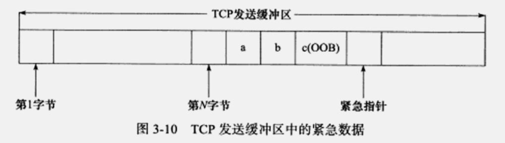

## 1. TCP报文段

   **问题：**

   1） 序列号只有32位，大数据传送不够用

序号占4字节。范围是[0, 2^^^32 - 1]，共2^32^个序号。序号增加到2^^^32 - 1后，下一个序号就又回到0。因此序号使用的是mod 2^32^运算。

   2） 带外数据 （Out Of Band, OOB）

**作用：用于迅速通告对方本端发生的重要事件。**因此它比普通数据具有更高的优先级，它总是应该被立即发送，而不论发送缓冲区是否有排队等待发送的数据。实际应用中，带外数据的使用有telnet、ftp等远程非活跃程序。

UDP没有实现带外数据传输，TCP也没有真正的带外数据。但TCP利用其头部中到的紧急指针标志和紧急指针两个字段，给应用程序提供了一种紧急方式。

**TCP发送带外数据过程：**



由上图可知，发送端一次发送的多字节的带外数据中只有最后一字节被当做带外数据（字母c），而其他数据被当做了普通数据。

**TCP接受带外数据过程：**

TCP只有在接收到**紧急指针标志**时才检查**紧急指针**，然后根据紧急指针所指的位置确定带外数据的位置，并将它读入一个特殊的缓存中。这个缓存只有1字节，被称为**带外缓存**。如果上层应用程序没有及时将带外数据从带外缓存中读出，则后续的带外数据将覆盖它。

**三次握手：**

三次握手中第二次（服务器回复SYN）能否进行取决于listen维护的半连接队列是否已满，如果满服务器则无法回复SYN给客户端。

查看半连接队列的大小？

```shell
cat /proc/sys/net/ipv4/tcp_max_syn
128
```

3） 发送的连接请求报文seq是随机的，为什么？

因为如果这个seq是固定的，则其他人也就知道了，对外传送数据时不安全。

4） FIN-WAIT2状态，客户端是如何对服务器发送的数据进行确认的？

正常对服务器发送过来的数据进行确认，且不消耗序列号。

5） 为什么需要超时等待？以及如何调整四次断连TIME-WAIT阶段的等待时间？

1. （这里默认客户端主动断开连接）确保最后的ACK报文段能够到达服务器，因为这个报文段有可能会丢失，因而使处在LAST_ACK状态的服务器一直收不到对方的ACK报文段而无法断开连接。因此设置了超时时间，如果大于这个时间还没收到客户端的ACK包，则服务器重新发送FIN报文段，这时客户端再重新设置超时时间。

2. **等待老的重复分节在网络中消逝，防止lost duplicate对后续新建的incarnation connection的传输造成破坏。**

   `lost duplicate`：在实际的网络中非常常见，经常是由于路由器产生故障，路径无法收敛，导致一个数据包在路由器A、B、C之间做类似死循环的跳转。IP头部有个TTL，限制了一个包在网络中的最大跳数。因此这个包有两种命运，

   - TTL变为0，在网络中消失；
   - TTL在变为0之前路由器路径收敛，它凭借剩余的TTL跳数终于到达目的地。但非常可惜的是TCP通过超时重传机制在早些时候发送了一个跟它一模一样的包，并且先于它到达了目的地，因此它注定被TCP协议栈抛弃；

   `incarnation connection`：跟上次的socket pair一模一样的新连接。倘若没有2MSL时间的TIME_WAIT状态来等待lost duplicate失效，那么就会出现如下情况，

   > 一个incarnation connection收到的seq=1000，这时来了一个lost duplicate为seq=1000，len=1000，则TCP认为这个lost duplicate合法，并存放入了receive buffer，导致传输出现错误。

**TIME_WAIT带来的问题：**

RFC要求socket pair在处于TIME_WAIT时，不能再起一个incarnation connection（与之前一样的TCP连接）。但绝大部分TCP实现，强加了更为严格的限制，“在2MSL等待期间，socket中使用的本地端口在默认情况下不能再被使用”。

这个限制对于client来说是无所谓的，但是对于server，就严重了。一旦server端主动关闭了某个client的连接，导致server监听的端口在2MSL时间内无法接受新的连接，这显然是不行的。

- 方案一 
  保证由client主动发起关闭。

- 方案二 
  server主动关闭的时候使用RST的方式，不进入 TIME_WAIT状态。 
  具体做法是设置socket的SO_LINGER选项。

- 方案三 
  给server的socket设置SO_REUSEADDR选项，这样的话就算server端口处于TIME_WAIT状态，在这个端口上依旧可以将服务启动。

  当然，“非相同socket pair”这个限制依然存在，即在2MSL时间内仍然拒绝来自与之前断掉的client相同ip和port的连接，错误信息为address already in use。

6） shutdown函数如何对close的引用计数进行优化？

**close关闭连接，引用计数减1**

关闭一个连接实际上就是关闭该连接对应的socket，通过关闭普通文件描述符的系统调用来完成：

```c
#include <unistd.h>
int close(int fd);
```

close系统调用不是立即关闭一个连接，而是将fd的引用计数减1.只有当fd的引用计数为0时，才真正关闭连接。

**shutdown立即关闭连接**

```c
#include <sys/socket.h>
int shutdown(int sockfd, int howto);
```

shutdown能够分别关闭socket上的读或写，或者都关闭。而close在关闭连接时只能将socket上的读和写同时关闭。

7） 当服务器进程绑定一个端口后，立即终止这个进程，再次启动该服务器进程绑定该端口号，会出现“Address already in use”，为什么？

见上面**TIME-WAIT带来的问题。**

## 2. 网络API

**补充知识：**

 内核为任何一个给定的监听套接字维护两个队列：

>**未完成连接队列(incomplete connection queue)**，当服务器接收到客户端发来三次握手的第一个SYN分片，此时对应套接字处于SYN_RECV状态，服务器会给对应客户端回复一个ACK+SYNC包，并把对应套接字放到未完成连接队列中。
>
>**已完成队列(completed connection queue)**，当客户端对服务器发来的SYNC包回复ACK确认包后，此时即完成三次握手过程，此时对应套接字处于ESTABLISHED状态，把对应套接字从未完成连接队列移到已完成连接队列中。

8）listen函数和accept函数为什么要分开来处理？

1. 必须要等连接建立完成后才能调用accept函数，不利于大量客户的并发执行。

9）listen函数为什么设置为非阻塞？

**为了满足大量客户端同时进行连接**，listen函数维护了**半连接队列**和**全连接**两个队列，当客户端请求连接时，先将这个连接放入半连接队列，等连接建立完成再放入全连接队列中，因此客户端一来连接就先放入前者，然后继续接受其他客户端连接请求，如果设置为阻塞，那么必须等连接完全建立才能处理下个连接，不利于程序的并发。

10）accept函数为什么设置为阻塞？

这样做的好处是服务器程序不必一直轮询，来查看是否有完全建立的连接，而且同时也不用在用户态和内核态之间来回切换，提高效率。

