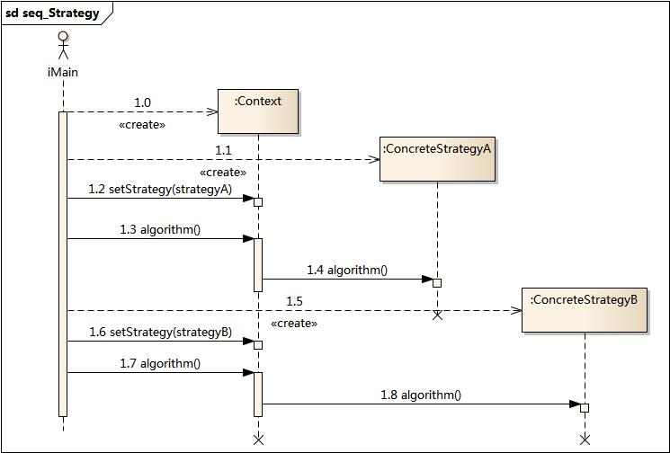

2017.10.6

**设计模式学习笔记--策略模式**

[TOC]

# 策略模式

## 1.模式定义

策略模式：定义了一系列的算法,这些算法都用来完成相同的功能,将每一个算法封装起来,客户端根据需要选择使用不同的算法。一句话解释就是,准备一组算法,并将每一个算法封装起来,使得它们可以互换。

## 2.模式动机

如果现在要实现排序功能,并且要求提供多种查找算法（快排、堆排、归并排序等），可以把这些算法封装成对应的函数放在一个类中,同样也可以把这些函数放在一个统一的方法中,该方法接收不同的参数,通过if/else或者switch语句来选择不同的排序函数,但是这样做违反了“开闭原则”，如果要增加新的排序方法,那么必须要修改原有类中的代码。

上述实现方式的缺点：1）代码不易维护 2）逻辑更加复杂

为了解决这些问题,可以定义一些独立的类来封装不同的算法,每一个类封装一个具体的算法,在这里,每一个封装算法的类我们都可以称之为策略(Strategy)，为了保证这些策略的一致性,一般会用一个抽象的策略类来做算法的定义,而具体每种算法则对应于一个具体策略类。

## 3.模式结构

策略模式包含如下角色：

- Context: 环境类
- Strategy: 抽象策略类
- ConcreteStrategy: 具体策略类

时序图:

## 4.模式分析

**优点：**

- 易扩展性,策略模式提供了对“开闭原则”的完美支持,用户可以在不修改原有系统的基础上选择算法或行为,也可以灵活地增加新的算法或行为。

- 便于管理,策略模式提供了管理一系列相关算法的办法。

- 逻辑简单,避免使用多重条件转移语句

**缺点：**

- 客户端必须知道所有的策略类,并且需要开解所有具体策略类之间的区别,以便选择合适的算法。

- 策略模式会造成产生很多策略类,可以通过使用享元模式在一定程度上减少对象的数量。

## 5.适用环境

在以下情况可以使用策略模式：

- 如果在一个系统里面有许多类,它们之间的区别仅在于它们的行为,那么使用策略模式可以动态地让一个对象在许多行为中选择一种行为。
- 一个系统需要动态地在几种算法中选择一种。
- 如果一个对象有很多的行为,如果不用恰当的模式,这些行为就只好使用多重的条件选择语句来实现。
- 不希望客户端知道复杂的、与算法相关的数据结构,在具体策略类中封装算法和相关的数据结构,提高算法的保密性与安全性。

参考文章链接：

1）http://design-patterns.readthedocs.io/zh_CN/latest/behavioral_patterns/strategy.html
